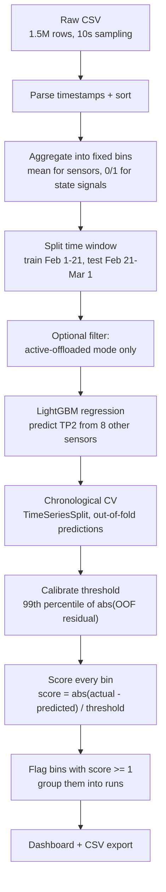

# MetroPT-3 Compressor Anomaly Detection

A Streamlit app and two Jupyter notebooks that detect unusual behaviour in a train air compressor by training a regression model and flagging large prediction errors.

## Overview

The project works with the [MetroPT-3 dataset from UCI](https://archive.ics.uci.edu/dataset/791/metropt%2B3%2Bdataset): about 1.5 million sensor readings (pressures, motor current, oil temperature, valve states) recorded from the compressor of a metro train between February and September 2020.

The problem: when a compressor develops a fault such as an air leak, its sensors stop behaving the way they normally do. Looking at a single fixed limit ("TP2 must be between X and Y") does not work well, because expected values change with the operating mode of the machine.

So this project takes a different route:

1. Learn what TP2 (compressor pressure) *should* be, given the other sensors.
2. Compare that prediction with the real reading.
3. Flag the moments where the error is unusually large.

Why it is useful: it gives a continuous, automatically calibrated "something is off" signal over the whole recording, instead of hand-picked static limits. It is a typical predictive-maintenance workflow: turn raw telemetry into review signals an engineer can look at.

At a high level, the project is:

- a **Streamlit app** (`app.py`) with the full pipeline and an interactive dashboard, and
- two **notebooks**: one for data exploration, one for the regression + anomaly-score baseline the app is built from.

## How It Works



1. **Data input.** The raw CSV is read from `data/raw/`. If the file is missing, the app downloads the UCI archive automatically and extracts it.
2. **Preprocessing.** Timestamps are parsed and sorted. Rows are aggregated into fixed time bins (1, 5, 10 or 15 minutes, 5 by default). Continuous sensors are averaged inside each bin; binary state signals (`COMP`, `DV_eletric`, `Towers`, ...) are converted to 0/1 with a 0.5 cut. Empty bins are dropped. The raw CSV is never modified.
3. **Feature preparation.** A fixed train/test window is selected (default: train 1–20 Feb, test 21–28 Feb). By default, only bins in the *active-offloaded* mode are kept (`COMP=1`, `DV_eletric=0`, motor current between 3.0 and 5.5 A), which avoids mixing in shutdown bins. Features are 8 other sensors: `TP3`, `H1`, `DV_pressure`, `Reservoirs`, `Motor_current`, `COMP`, `DV_eletric`, `Towers`. Missing values are filled with medians learned from the training rows only.
4. **Regression.** A LightGBM regressor predicts `TP2`. Quality is checked with an expanding-window `TimeSeriesSplit` (5 folds) plus a final untouched test week.
5. **Anomaly detection.** The threshold comes from the out-of-fold residuals (see next section). Every bin in the recording is then scored, and bins at or above the threshold are flagged. Consecutive flagged bins are grouped into "runs" (a run breaks when the time gap exceeds the aggregation window).
6. **Results/output.** The dashboard shows metrics, plots, the top 20 anomalies and the run list, and can export everything as a CSV.

## Regression-Based Anomaly Detection

**The model.** A LightGBM gradient-boosting regressor predicts the compressor pressure `TP2` from the other sensors. The defaults are `n_estimators=300`, `learning_rate=0.05`, `num_leaves=31`, `random_state=42` (all adjustable in the app sidebar).

**The residual.** For each bin we compare the real reading with the model prediction:

```
residual  = actual TP2 - predicted TP2
abs_error = |residual|
```

When the model is working normally, the residual is small: the other sensors explain what TP2 is doing. A large residual means TP2 moved in a way the rest of the system does not explain — which is the anomaly signal.

**How the threshold is set.** The threshold is **not** computed from the training residuals in-sample (those are too optimistic). Instead the project uses out-of-fold (OOF) predictions from an expanding-window `TimeSeriesSplit(n_splits=5)`: every validation row is predicted by a model that never saw it, and those errors are collected. The threshold is then the **99th percentile of the absolute OOF residuals**:

```
threshold = quantile(|OOF residual|, 0.99)      # default quantile = 0.99
```

With the default settings this is **0.5154 bar**. An alternative rule — OOF mean + 3 standard deviations of the absolute residuals (**0.3763 bar**) — is computed as a comparison; the quantile is the selected baseline. Both are shown in the app, and the quantile is a slider (0.90 to 0.999).

**Scoring.** The score is the error relative to the threshold:

```
raw_anomaly_score = |residual| / threshold
is_anomaly         = raw_anomaly_score >= 1
anomaly_score      = min(raw_anomaly_score, 1)   # clipped 0-1 for plotting
```

So a score of 1.0 means "error exactly at the threshold", and everything above 1.0 is flagged. The clipping only affects the display line, not the ranking of anomalies.

**Why this makes sense here.** The sensors are physically coupled: pressures, valve states and motor current move together. A regression model captures that normal coupling, so the threshold can be expressed as a model error instead of a fixed physical limit. On top of that, calibrating on OOF residuals means the threshold is derived from errors on data the model did not train on, and it can be moved with a single slider instead of re-editing hard-coded bounds.

## Why Regression-Based Detection?

- **Fixed thresholds fail across operating modes.** The same `TP2` value can be perfectly normal in one state and wrong in another. The model conditions on the valve signals and motor current, so "normal" is defined per state.
- **It uses the whole system, not one channel.** A single-sensor limit ignores that `TP3`, `H1`, `Reservoirs` and `Motor_current` normally track `TP2`. The regression uses all of them together.
- **The threshold is data-driven and tunable.** The 99th percentile of OOF errors is computed automatically and can be changed from the UI (a stricter/looser cut-off is one slider move).
- **The calibration avoids the usual trap.** Using training residuals would make the threshold far too tight; using OOF residuals keeps the calibration honest, and the final test week is never used to pick the threshold.
- **It is easy to explain and debug.** Every flagged point comes with actual value, prediction and residual, so a reviewer can see *why* it was flagged.

Other methods (isolation forest, autoencoders, etc.) were not used; the repository implements the residual approach only.

## Example / Demo

**1. Install**

```bash
uv sync
```

(If you do not have [uv](https://docs.astral.sh/uv/): `python -m venv .venv && source .venv/bin/activate && pip install ipykernel lightgbm nbclient nbformat numpy pandas plotly scikit-learn streamlit`.)

**2. Run the app**

```bash
uv run streamlit run app.py
```

Open the URL printed in the terminal (by default <http://localhost:8501>). The first run downloads the dataset if the CSV is missing from `data/raw/` (~208 MB).

**3. What to look at**

| Tab | What it shows |
|---|---|
| Overview | Row/bin counts, threshold value, number of flagged bins, column dictionary, data coverage |
| Exploration | Interactive signal plots and the Pearson correlation matrix |
| Model | Per-fold CV metrics, train/OOF/test metrics, actual-vs-predicted scatter, residual histogram, feature importance, residual quantiles |
| Anomalies | Anomaly score timeline, actual vs predicted TP2 with flagged points, top 20 anomalies, anomaly runs, score distribution, CSV download |

Useful things to try in the sidebar:

- Set **Threshold quantile** to `0.90` and watch the number of flagged bins jump.
- Turn off **Restrict to active-offloaded mode** and see how the model behaves when it is trained on every operating state.
- Change the **Aggregation window** from `5min` to `1min` and compare the number of bins.

There are no saved screenshots in this repository — the charts are rendered live by the app.

**Notebooks**

```bash
uv run jupyter execute notebooks/metropt3_exploration.ipynb --inplace
uv run jupyter execute notebooks/metropt3_tp2_regression.ipynb --inplace
```

Opening them in VS Code or another Jupyter-capable editor works as well.

## Results

The notebooks are committed with their outputs cleared, so the numbers below come from running the pipeline with the default settings (fixed `random_state=42`, so they are reproducible).

**Data**

| Item | Value |
|---|---|
| Raw rows | 1,516,948 |
| Recording period | 1 Feb 2020 – 1 Sep 2020 |
| Nominal sampling | 10 seconds |
| Missing values | none in the raw CSV |
| 5-minute bins after aggregation | 50,782 |
| Training bins (default filter/window) | 1,141 |
| Test bins (21–28 Feb, filtered) | 474 |

**Model quality (default settings)**

| Split | MAE | RMSE | R² |
|---|---|---|---|
| Train (in-sample) | 0.0200 | 0.0343 | 0.9995 |
| CV folds (mean ± std, 5 folds) | 0.0724 ± 0.0237 | 0.1201 ± 0.0365 | 0.9935 ± 0.0037 |
| OOF (pooled, 950 rows) | 0.0724 | 0.1245 | 0.9934 |
| Test (untouched week, 474 bins) | 0.0510 | 0.0878 | 0.9967 |

The gap between train and OOF error shows some in-sample overfitting, while the untouched test week stays close to the cross-validation results.

**Threshold and anomaly summary (defaults)**

| Item | Value |
|---|---|
| Threshold (99th percentile of \|OOF residual\|) | 0.5154 bar |
| Alternative threshold (OOF mean + 3σ) | 0.3763 bar |
| Scored bins | 50,782 |
| Flagged bins | 7,089 (13.96%) |
| Anomaly runs | 3,888 |
| Maximum raw score | 11.76 |

**Feature importance (split count, final model)**

| Feature | Splits |
|---|---|
| `H1` | 2732 |
| `Motor_current` | 2024 |
| `TP3` | 1913 |
| `DV_pressure` | 1639 |
| `Reservoirs` | 692 |
| `COMP`, `DV_eletric`, `Towers` | 0 |

**Reading these numbers.** The model is only trained on the active-offloaded mode, but scores are produced for every bin in the recording. This matters for interpretation: of the 7,089 flagged bins, **6,956 (about 98%) fall outside that training mode** — the flag rate is 0.9% inside the active-offloaded mode versus 19.1% outside it. Those flags are a distribution shift, not confirmed faults. The app states this in its own caption: above-threshold scores are review signals, not confirmed failures. There are no labels in this project, so no precision/recall numbers are reported.

## Project Structure

```
.
├── app.py                                # Streamlit app: full pipeline + dashboard
├── notebooks/
│   ├── metropt3_exploration.ipynb        # Data exploration, plots, correlations (no model)
│   └── metropt3_tp2_regression.ipynb     # Regression baseline: CV, threshold, scoring
├── data/
│   └── raw/
│       ├── MetroPT3(AirCompressor).csv   # Raw dataset (~208 MB, downloaded if missing)
│       └── metropt3_uci.zip              # Original UCI archive
├── pyproject.toml                        # Dependencies (managed with uv)
└── uv.lock                               # Locked dependency versions
```

## Installation

**Requirements**

- Python >= 3.10 (the project is developed on Python 3.13)
- [uv](https://docs.astral.sh/uv/) (recommended), or a plain virtualenv + pip
- No API keys or environment variables are needed

**Steps**

```bash
# 1. Get the dependencies
uv sync

# 2. (optional) confirm the environment
uv run python -c "import streamlit, lightgbm, sklearn; print('ok')"
```

The dataset is fetched automatically the first time the app starts. To download it manually:

```bash
mkdir -p data/raw
curl -L -o data/raw/metropt3_uci.zip "https://archive.ics.uci.edu/static/public/791/metropt+3+dataset.zip"
```

## Usage

```bash
# Start the dashboard
uv run streamlit run app.py

# Run the notebooks
uv run jupyter execute notebooks/metropt3_exploration.ipynb --inplace
uv run jupyter execute notebooks/metropt3_tp2_regression.ipynb --inplace
```

Everything is configured from the app sidebar: aggregation window, train/test dates, the operating-mode filter, LightGBM hyperparameters and the threshold quantile. No config files are required.

## Technologies Used

| Area | Tools |
|---|---|
| Language | Python (>= 3.10) |
| Data handling | pandas, NumPy |
| Modeling | LightGBM, scikit-learn (`TimeSeriesSplit`, MAE/RMSE/R² metrics) |
| Dashboard | Streamlit |
| Charts | Plotly |
| Notebooks | Jupyter / ipykernel, nbclient, nbformat |
| Environment | uv |
| Data source | UCI MetroPT-3 dataset (CC BY 4.0) |

## Key Features

- Automatic download and handling of the raw UCI dataset
- Time-bin aggregation of high-frequency telemetry (continuous means, binarized state signals)
- Operating-mode filtering to keep training data in a known-good regime
- LightGBM regression of `TP2` with chronological cross-validation and a held-out test week
- Threshold calibrated from out-of-fold residuals, with a tunable quantile and a μ+3σ alternative
- Anomaly scoring, flagging and grouping of consecutive flagged bins into runs
- Interactive dashboard: EDA, model diagnostics, residual plots, feature importance
- Top-20 anomaly table and one-click CSV export of full results
- Leakage-conscious design documented in the notebook (fold-local imputation, no test-driven tuning, fixed feature list)

## Limitations

- **No labels are used.** The repository does not evaluate flags against any ground truth, so there is no precision, recall or F1. UCI publishes known failure windows for this dataset, but this project does not compare against them.
- **One regime, one short period.** The threshold is calibrated from 950 OOF bins taken from 1–20 February in a single operating mode. The notebook itself calls the threshold confidence "limited to moderate".
- **Scores outside the training mode are suspect.** Bins from other operating states are scored with a model that never saw them, so high scores there may be distribution shift instead of faults.
- **Contemporaneous estimation, not forecasting.** Features and target come from the same time bin, so the model estimates current `TP2` rather than predicting the future.
- **The test set is one week** (21–28 February 2020), which is weak evidence for long-term behaviour.
- **Default hyperparameters.** There is no hyperparameter search; settings are hand-picked defaults exposed as sliders.
- **No tests, CI, or saved model artifacts.** The app retrains on every run, and the notebooks are committed without outputs.

## Future Improvements

- Evaluate detected runs against the failure reports published with the UCI dataset
- Train separate models per operating mode, or add the operating mode as an explicit regime feature
- Validate over the full February–September recording instead of one week
- Add a batch scoring script or a small API endpoint that returns results without the dashboard
- Persist the trained model and threshold instead of retraining on every app start
- Add unit tests for aggregation, thresholding and run grouping, plus a basic CI setup

## Portfolio Highlights

This project shows an end-to-end, leakage-aware ML workflow on real industrial telemetry:

- **Data preprocessing** — turning 1.5M irregularly sampled rows into clean, aggregated time bins
- **Regression modeling** — gradient boosting with hyperparameters you can tune live
- **Statistical anomaly detection** — residual-based scoring with a threshold calibrated on out-of-fold errors
- **Time-series validation** — chronological `TimeSeriesSplit`, held-out test period, fold-local imputation
- **Data visualization** — interactive Plotly charts for EDA, diagnostics and anomaly review
- **Software engineering** — a single-file Streamlit app, reproducible environment with uv, automatic dataset download
- **Honest evaluation** — documented assumptions, generalization gaps and limitations instead of inflated numbers

## License

No license file is currently specified for this repository — treat the code as unlicensed unless the author states otherwise.

The dataset itself is licensed under [CC BY 4.0](https://creativecommons.org/licenses/by/4.0/) by the UCI Machine Learning Repository:

> Davari, N., Veloso, B., Ribeiro, R.P., Pereira, P.M., Gama, J. (2021). MetroPT-3 Dataset [Dataset]. UCI Machine Learning Repository. https://doi.org/10.24432/C5VW3R
